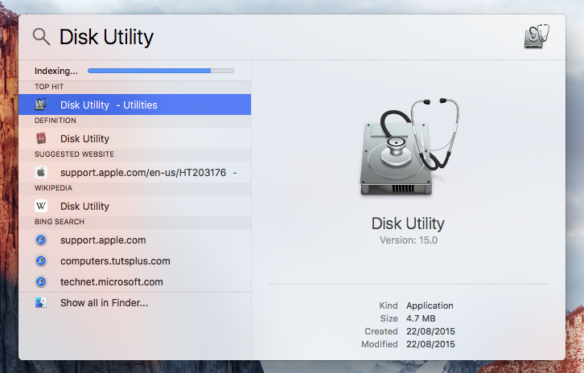
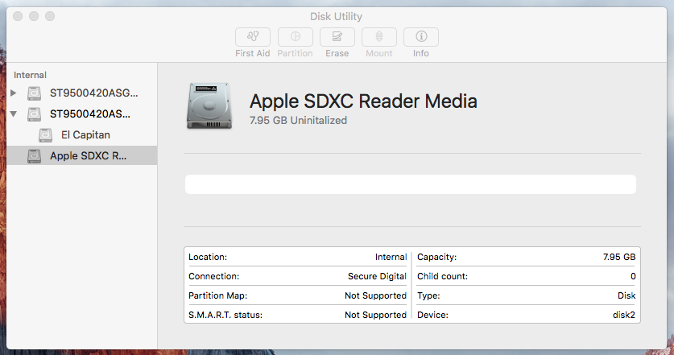
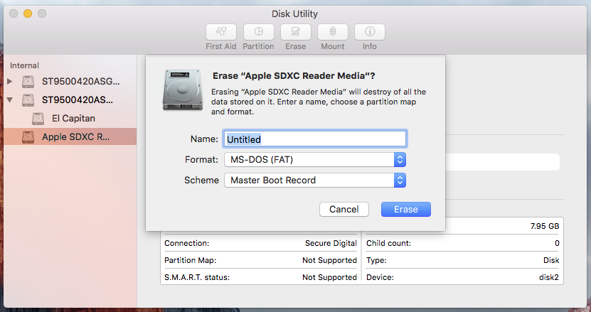
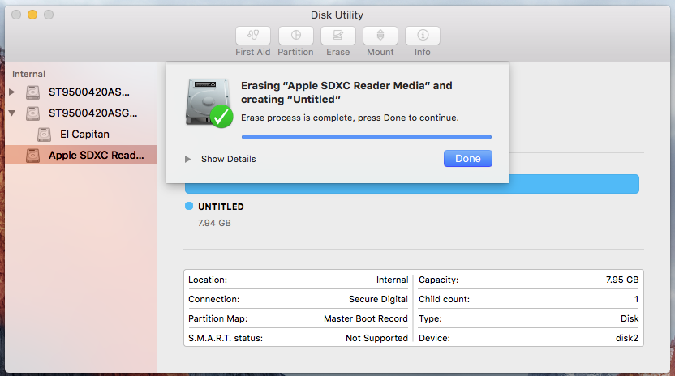
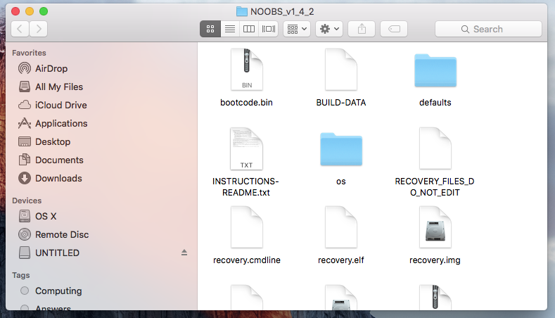
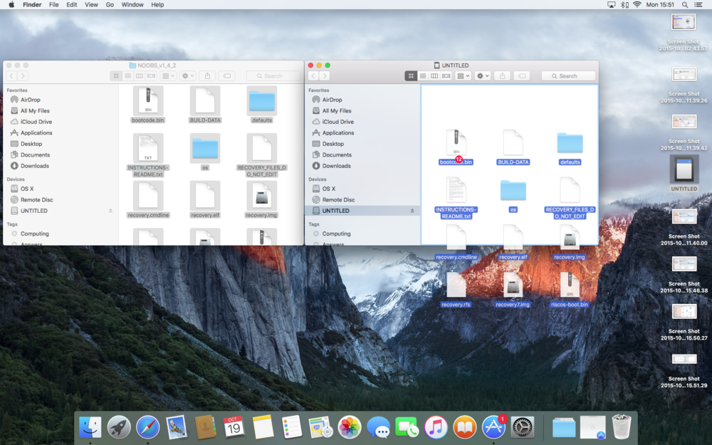

# Installing Raspbian using Apple OS X El Capitan

## Preparing the SD card

If you have a fresh SD card then the following steps may not be necessary, but they won't do any harm if you are unsure.

1. Start *Spotlight* either by clicking on the magnifying glass in the top right hand corner of the screen, or by tapping the *Command Key* and *Space* on your keyboard.

2. Type *Disk Utility* into the search bar.

  

3. Choose the *Disk Utility* program, which should be the the top result.

4. In the *Disk Utility* program, the available disks should be listed in the left-hand panel. Select the available disk reoresenting the SD card, and check that the *Capacity* matches the SD card that you inserted.

  

5. Click the *Erase* button in the menu bar.

6. Change the *Format* to **MS-DOS (FAT)** and click on *Erase*.

  

7. When the format has completed click on *Done*.

  

## Copying over the files

1. OS X automatically extracts downloaded zip files, so in your Downloads folder you should see a folder titled *NOOBS* with some version numbers after it.

  

2. Open up a new *Finder* window and navigate to the SD card. It is best to position the two windows side by side.

  

3. Select all the files in the *NOOBS* folder and drag them into the SD card window.

  

4. Eject the SD card.

4. That's it: you're finished. Click on the link below the image to learn how to install Raspbian Jessie on your Raspberry Pi.
